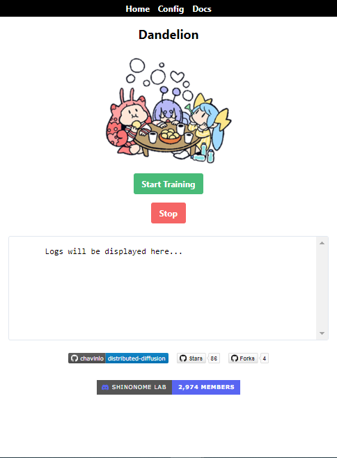

# Dandelion: Decentralized SD Model Training
Train Stable Diffusion models across the internet with multiple peers

By leveraging the power of multiple computers as peers, this project enables the training of machine learning models across the internet with high efficiency and fault-tolerance. The distributed training is facilitated by a DHT (Distributed Hash Table) which ensures that all peers are able to connect and share their training data. The resulting model is then averaged across all peers, ensuring that the final model is highly accurate and reliable. This decentralized approach allows for efficient and scalable model training without the need for a master node.

# Sponsors
- [Redmond.ai](http://www.redmond.ai/): Providing enterprise-grade compute and A100/4090s to test the swarm on. Thanks!

# Features

- Relay and Client mode (Client needs no firewall configuration)
- 17.5GB of VRAM (Xformers, 8Bit, Fp16, Grad Checkpointing enabled)
- Linux and WSL compatible

## Dataset Server
- Syncable configuration for LR-Scheduler and Training parameters
- Internal-DHT server used as initial peer
- Dataset Chunk Management and Distribution
## Trainer Manager
- Friendly Web-UI

- Logs terminal
- Easy configuration page
- Mid-training stop and joining
- Telemetry and Networking configuration (with port-forwarding support)

# Documentation

Documentation on how to setup your own swarm will be available soon!

# Upcoming features:
- Forever-running finetune on Danbooru 2021 that anyone can join to
- Vram usage reduction of 2-4GB
- Docker Image
- Server List with easy join
- Metrics charts of the global progress
- Telemetry Data Visualization
- Max-Checkpoints saving
- Peer scoring system
- Better Security

# Contributing & Support

All contributions are welcome!

If you need help, or want to know more about the project, join the discord: https://discord.gg/8Sh2T6gjd2

# Issues & Bugs:

- Checkpoints save too often and could eat a ton of disk sapce (Just set a high save steps number)
- No security whatsoever (see hivemind's CLIP averaging (not related to openai clip at all))

## Credits:
- Haru: Wrote the first trainer and rewrote it from scratch optimizing it
- dep (me): Hivemind integration, dataset server
- Lopho: Helped a lot by rewriting the bucketing code
- Graham (Redmond.ai): Provided compute for the tests and development
- The 7 peers that joined during the training of 14th December, 2022.
- Everyone on the SAIL discord.
